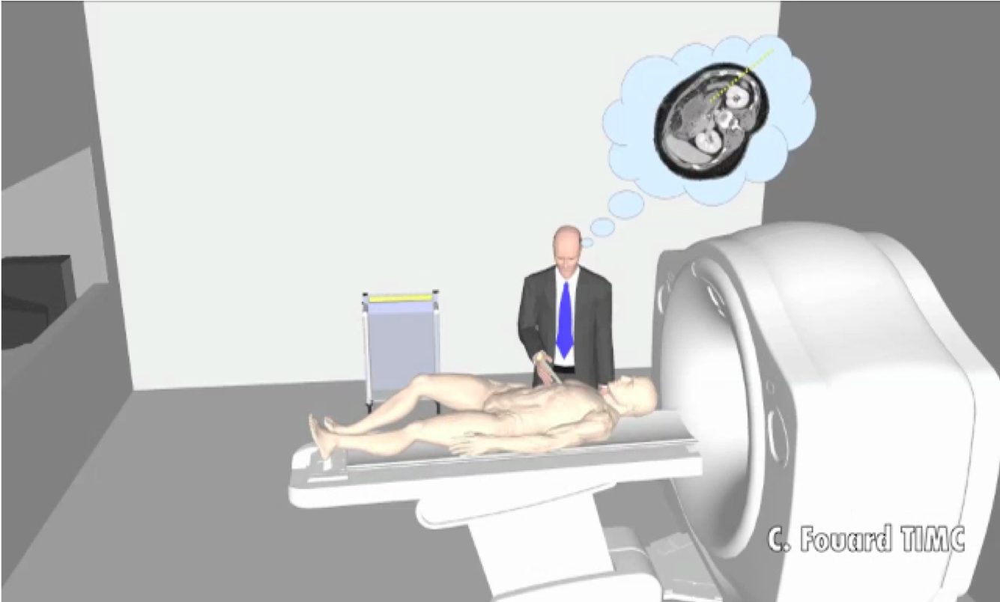
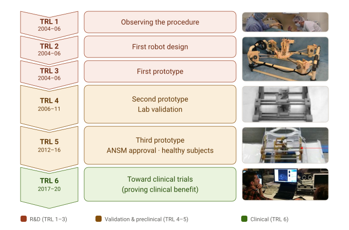
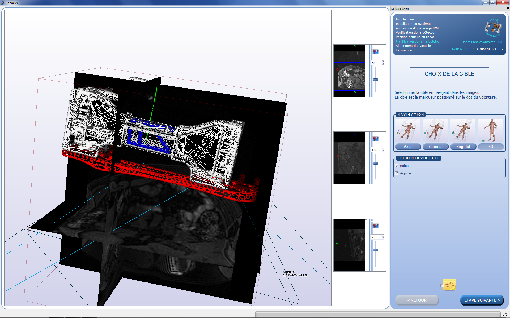
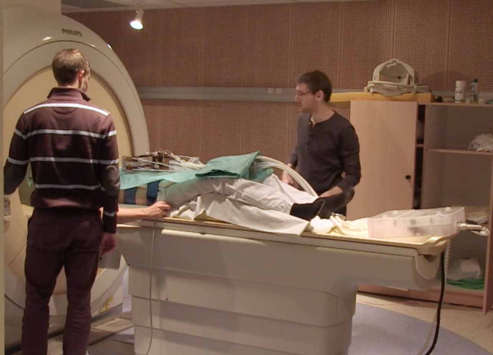

*Taking a medical robot from concept to first-in-human trials: TRL maturation, quality assurance, risk analysis and industrial spin-off.*

## The clinical gesture

Inserting a needle under image guidance is a common interventional-radiology procedure: for a biopsy or tumour ablation, the clinician acquires a volume image, plans a trajectory on one slice, then inserts the needle. The gesture is delicate — at the moment of insertion the radiologist has very few guidance tools and relies mostly on experience and on memorising the chosen slice. Under CT, checking the trajectory means repeated control images, hence radiation and back-and-forth; under MRI, the gesture becomes almost impossible to perform by hand inside the bore.

  <figure style="flex:1; margin:0;">
    
  </figure>
  <figure style="flex:1; margin:0;">
    
  </figure>

The LPR (*Light Puncture Robot*) addresses this: a lightweight robot placed directly on the patient to follow its motion as closely as possible, able to hold, position and insert the needle under the clinician's control. It is compatible with both X-ray CT and MRI — therefore built entirely from non-ferromagnetic materials — and registers itself automatically in the image. The video below sums it up, from registration to needle positioning:



## Climbing the TRLs

The real challenge with a medical device isn't having the idea: it's pushing it up the technology-readiness levels (TRL) until it can be tested on humans. Here is the path the LPR travelled, from concept (TRL 1) to clinical prototype (TRL 6):

The first steps were quick: observing the clinical procedure, the first design, the first prototype (the α prototype, already there when I joined the team). The real work started afterwards. **Moving from TRL 4 to TRL 5** — from a lab-validated robot to one cleared for testing on humans — took far more than research: a redesign of the code under **quality assurance**, a full **risk analysis**, and outside expertise. We worked with our partner **Axe Systems** to manufacture the mechanical part under quality assurance, and with the clinical investigation centre (**CIC-IT**) of Grenoble Alpes University Hospital and the company **SQI** for risk analysis and quality-controlled development. This file secured clearance from the French medicines agency (**ANSM**) and let us build a protocol guaranteeing the robot's safety for **preclinical trials on healthy subjects in MRI**, without needle insertion.

These trials mobilised, over two years, a ten-person team that I coordinated (3 from the CIC-IT, 3 from TIMC, 2 from Axe Systems, 2 from SQI).

> Moving from TRL 4 to TRL 5 means rewriting the code under quality assurance, running a risk analysis, and making research, clinical and industry teams work together. That is exactly the work a company expects when it wants to turn a promising prototype into a credible device.

The next step — industrialisation — could no longer happen in the lab. So I led a **start-up** project built on the robot, supported by Grenoble's tech-transfer office (**SATT Linksium**), first in **maturation** (2017) then in **incubation** (2018–2019). This phase produced **two patents** and **two applications to the national BPI i-Lab innovation contest** (2018 and 2019). The feedback was excellent — 17/20 on the technology dimension, 14.6/20 on the financial dimension, 14.8/20 overall — but the project was ultimately not funded. I recruited and supervised an engineer (Jérémy Lenfant) and then two successive co-founders for the business side (Bertrand Perrin, then Antoine Bourrier).

## Project management: the funding

Beyond the technical side, the LPR was a long exercise in coordination at the research / clinical / industry interface, backed by a series of grants I secured and ran:

| Project | Role | Funder / type | Partners | Period |
|---|---|---|---|---|
| Robacus | Coordinator | ANR TecSan — ANR-11-TECS-020-01 | TIMC, LIRMM, Grenoble Alpes Univ. Hospital (CIC-IT, radiology), Axe Systems | 2012–2015 |
| LPROP | Coordinator | Carnot LSI Institute — pre-maturation | TIMC | 2015–2016 |
| Emergence (×2) | Coordinator | TIMC — internal (equipment & interns) | TIMC | 2016–2017 |
| LPR maturation | Coordinator | SATT Linksium | TIMC, Linksium | 2017 |
| LPR incubation | Coordinator | SATT Linksium | Linksium, co-founders | 2018–2019 |

## Behind the scenes: remote control of the robot

In collaboration with the **LIRMM team (Montpellier)**, a partner in the Robacus project, we demonstrated real-time remote control of the robot through a force-feedback teleoperation interface — a step toward a gesture where the radiologist would drive insertion from the control room, without radiation exposure. This feasibility demo was not taken further, but it nicely illustrates the flexibility of the guidance software's architecture, built on [CamiTK](/en/projects/camitk/), the medical-application prototyping framework I co-develop: its modularity made it possible to reuse code from one prototype version to the next, rather than rewriting everything.

<!-- Teleoperation video (teleoperation-lirmm.mp4) to insert here once editing is done. -->


## Skills brought to bear

Multi-partner project coordination (research · clinical · industry) · **quality-assured** and **risk-analysed** development of a medical device · running regulated **preclinical trials** on healthy subjects · **TRL maturation** of a software component, from concept to clinical prototype · industrial **maturation and incubation** (patent drafting, business plan, team recruitment) · modular, reusable software architecture for medical prototyping.

## Related publications


