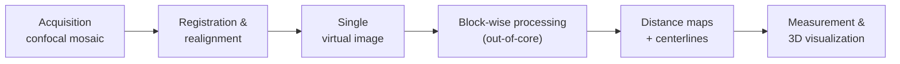

*Measuring the brain in 3D: from microscopy to software tools.*

My PhD took place at **INRIA Sophia Antipolis**, in the Epidaure team, under the supervision of Grégoire Malandain. It was part of the **MicroVisu3D** project, which brought together three worlds: the **anatomists** at INSERM (unit U455), who needed to quantify cerebral microcirculation; the **image-analysis** researchers at INRIA; and an **industrial partner**, TGS Europe, publisher of the 3D visualization software *Amira*.

It was a **CIFRE thesis**, funded by the company: from the very start of my doctorate, I worked at the direct interface between academic research and industry. My role was to translate a scientific need — *"to be able to measure the cortical vascular network in 3D"* — into a concrete set of software tools, usable by non-programmers and integrable into an existing industrial environment.

> This work led to publications in international peer-reviewed journals and conferences. But beyond the scientific output, what I describe here is an experience of **applied R&D delivered end to end** — from gathering the need to shipping field-tested tools.

This thesis embodies an idea that still guides my work today: **an algorithm is only worth as much as its robustness on real data — imperfect, voluminous, and all different from one another.**

---

## The challenge: measuring a vast network at micron scale

To study the cerebral micro-vascular network, the anatomists needed images able to capture **the smallest capillary** (resolution of a few microns) over a **cortical surface large enough** to be statistically significant (on the order of a centimetre). No instrument could acquire such an image in a single shot.

The chosen solution: **tile the area to be imaged with many small images** acquired under a confocal microscope, then assemble them into a single large "image mosaic". This solved the acquisition problem, but created two new ones:

- the resulting mosaic was **too large to be loaded into the memory** of a standard computer and processed in one go;
- the confocal microscope imposes an **anisotropic grid** (voxels are not cubic), which complicates any distance measurement in the image — and therefore any computation of vessel diameter.



## My approach: an end-to-end processing pipeline

I designed a complete pipeline, from the sensor to the measurement, built from the outset to run on data that does not fit in memory.

Two links in this pipeline gave rise to original methodological contributions: the computation of **distance maps** and the extraction of **centerlines**.

## Contribution 1 — Distance maps that adapt on their own

To measure the radius of a vessel at each point, one computes a *distance map*: at each voxel, the distance to the nearest boundary. The exact Euclidean distance is costly; **chamfer distances** approximate it very efficiently by propagating small integer weights between neighbouring voxels.



The tricky part: on an anisotropic grid — the case for almost every medical imaging modality — these weights have to be recomputed, and choosing them by hand is fragile and modality-specific.

My contribution was to propose an **automatic computation of the optimal chamfer coefficients**, the set that minimizes the error against the true Euclidean distance — and this **whatever the grid anisotropy or the imaging modality**, with no manual tuning. The same method therefore applies equally to a CT scan, an MRI or a confocal microscope.

> The theoretical foundations of these chamfer masks were deepened during my post-doctorate: see [From mathematical foundations to medical images](/en/projects/postdoc-uppsala/).

## Contribution 2 — Extracting centerlines, even out-of-core

From the distance map, one extracts the **centerlines** of the vessels — the curves running through the centre of each vessel. They capture the topology of the network and make it possible to measure lengths, branchings and radii.

Classical skeletonization methods require loading the whole image into memory — impossible here. So I proposed a **block-wise skeletonization** that works on sub-images while preserving the three essential properties of a skeleton: **homotopy** (same topology as the original object), **localization** (the skeleton stays centred) and **thinness**. The algorithm also minimizes the number of sub-image accesses, to keep computation time acceptable.



Once centerlines and radii are obtained, the vessels are modelled as **sets of cylinders** (the *LineSet* data structure), allowing both real-time 3D visualization and the extraction of quantitative parameters: distributions of diameters, of lengths, vascular densities per cortical layer, and so on.



## A generic method, far beyond the brain

None of these methods makes any assumption specific to the brain. **Any large binary image of tubular structures** can be processed in the same way. I validated it on plant roots; it transfers directly to neural networks, to the porosity of materials, even to pipeline mapping.



This ability to solve a problem in one domain and then transpose it elsewhere is at the heart of how I approach prototyping.

## Skills involved

- Gathering a scientific need and translating it into software specifications
- Collaboration with an industrial partner (CIFRE thesis, integration into the *Amira* software / TGS Europe)
- Design of **robust, automatic algorithms**, with no manual tuning
- Processing **large, out-of-core data** (block by block)
- Discrete geometry, chamfer distances, discrete topology
- Design of **validation** protocols (synthetic + real data)

## Publications from the thesis



## What this thesis taught me

This thesis was, for me, **a first school of applied prototyping** — far more than a theoretical exercise.

Because it was a CIFRE thesis, I first learned to **work between several worlds**: to ask anatomists the right questions, to translate their need into an algorithmic problem, and to deliver a result that could be integrated into an industrial partner's software. This stance — a translator between use and technique — has stayed at the centre of my practice.

I then built the reflex of **designing robust, automatic methods**. Faced with data that was all different — varying anisotropic grids, uneven contrast — I sought algorithms that *adapt by themselves* rather than multiplying manual settings, a source of fragility and variability.

I also developed a taste for **generality**: building tools that outgrow their initial use case. The same building blocks, designed for the brain, proved useful for plant roots — and many other domains.

Finally, I learned to deal with a very concrete constraint: **data too large for memory**. Thinking of computation piece by piece, without ever sacrificing the correctness of the result, is a skill that serves in any project handling large volumes.

These skills — built *alongside* a sustained effort of scientific publication — are the ones I now put at the service of medical-application prototyping.
