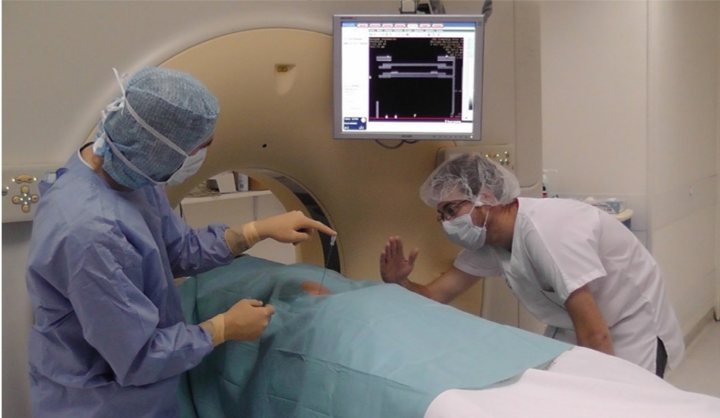
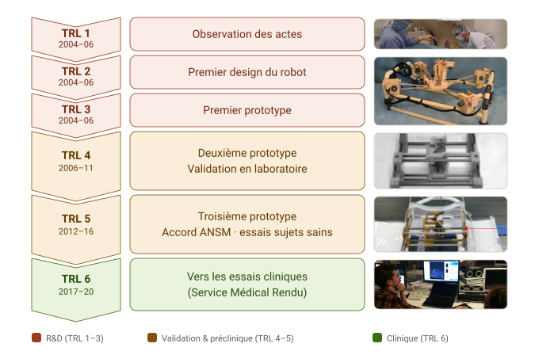

*Mener un robot médical du concept aux premiers essais sur l'humain : montée en TRL, assurance qualité, analyse de risques et maturation industrielle.*

## Le geste à assister

Insérer une aiguille sous contrôle d'imagerie est un acte de radiologie interventionnelle courant : pour une biopsie ou l'ablation d'une tumeur, le clinicien acquiert une image volumique, repère une trajectoire sur une coupe, puis insère l'aiguille. Le geste est délicat — au moment de l'insertion, le radiologue dispose de très peu d'outils de guidage et se fie surtout à son expérience et à la mémorisation de la coupe choisie. Sous scanner, vérifier la trajectoire impose des images de contrôle répétées, donc de l'irradiation et des allers-retours ; sous IRM, le geste devient presque impossible à réaliser à la main dans le tunnel.

  <figure style="flex:1; margin:0;">
    
  </figure>
  <figure style="flex:1; margin:0;">
    
  </figure>

Le LPR (*Light Puncture Robot*) répond à ce problème : un robot léger posé directement sur le patient pour suivre au plus près ses mouvements, capable de tenir, positionner et insérer l'aiguille sous le contrôle du clinicien. Il est compatible à la fois avec le scanner X et l'IRM — donc entièrement fabriqué en matériaux non ferromagnétiques — et se recale automatiquement dans l'image. La vidéo ci-dessous le résume, du recalage au positionnement de l'aiguille :



## La montée en TRLs

La vraie difficulté d'un dispositif médical n'est pas d'avoir l'idée : c'est de lui faire franchir les niveaux de maturité technologique (TRL) jusqu'à pouvoir la tester sur l'humain. Voici le chemin parcouru par le LPR, du concept (TRL 1) au prototype clinique (TRL 6) :

Les premiers paliers ont été rapides : observation du geste clinique, premier design, premier prototype (le prototype α, présent à mon arrivée dans l'équipe). Le vrai travail a commencé ensuite. **Passer du TRL 4 au TRL 5** — d'un robot validé en laboratoire à un robot autorisé à être testé sur l'humain — a demandé infiniment plus que de la recherche : une refonte du code sous **assurance qualité**, une **analyse de risques** complète, et le recours à des compétences extérieures. Nous avons collaboré avec notre partenaire **Axe Systems** pour la fabrication de la partie mécanique sous assurance qualité, et avec le **CIC-IT du CHU Grenoble Alpes** ainsi que l'entreprise **SQI** pour l'analyse de risques et le développement qualité. Ce dossier a permis d'obtenir l'accord de l'ANSM et de monter un protocole garantissant la non-dangerosité du robot pour des **essais précliniques sur sujets sains en IRM**, sans insertion d'aiguille.

Ces essais ont mobilisé, pendant deux ans, une équipe de dix personnes que j'ai coordonnée (3 du CIC-IT, 3 du TIMC, 2 d'Axe Systems, 2 de SQI).

> Passer du TRL 4 au TRL 5, c'est refondre le code sous assurance qualité, mener une analyse de risques et faire dialoguer recherche, clinique et industrie. C'est exactement le travail qu'attend une entreprise qui veut transformer un prototype prometteur en dispositif crédible.

L'étape suivante — l'industrialisation — ne pouvait plus se faire en laboratoire. J'ai donc porté un projet de **start-up** à partir du robot, accompagnée par la SATT **Linksium** de Grenoble, d'abord en **maturation** (2017) puis en **incubation** (2018–2019). Cette phase a abouti à **deux brevets** et à **deux candidatures au concours BPI i-Lab** (2018 et 2019). Les retours ont été excellents — 17/20 sur la dimension technologique, 14,6/20 sur la dimension financière, 14,8/20 en note générale — mais le projet n'a finalement pas été financé. J'y ai recruté et encadré un ingénieur (Jérémy Lenfant) puis deux cofondateurs successifs pour la partie *business* (Bertrand Perrin, puis Antoine Bourrier).

## Gestion de projet : les financements

Au-delà de la technique, le LPR a été une longue aventure de coordination à l'interface recherche / clinique / industrie, soutenue par une série de financements que j'ai obtenus et pilotés :

| Projet | Rôle | Financeur / type | Partenaires | Période |
|---|---|---|---|---|
| Robacus | Coordinatrice | ANR TecSan — ANR-11-TECS-020-01 | TIMC, LIRMM, CHU Grenoble Alpes (CIC-IT, radiologie), Axe Systems | 2012–2015 |
| LPROP | Coordinatrice | Institut Carnot LSI — pré-maturation | TIMC | 2015–2016 |
| Emergence (×2) | Coordinatrice | TIMC — interne (matériel & stagiaires) | TIMC | 2016–2017 |
| Maturation LPR | Coordinatrice | SATT Linksium | TIMC, Linksium | 2017 |
| Incubation LPR | Coordinatrice | SATT Linksium | Linksium, cofondateurs | 2018–2019 |

## En coulisses : piloter le robot à distance

En collaboration avec l'équipe du **LIRMM (Montpellier)**, partenaire de l'ANR Robacus, nous avons démontré la commande à distance du robot en temps réel, via une interface de téléopération à retour d'effort — une étape vers un geste où le radiologue piloterait l'insertion depuis la salle de contrôle, sans s'exposer aux rayonnements. Cette démonstration de faisabilité n'a pas été poussée plus loin, mais elle illustre bien la souplesse de l'architecture du logiciel de guidage, bâti sur [CamiTK](/fr/projects/camitk/), l'atelier de prototypage d'applications médicales que je co-développe : sa modularité a permis de réutiliser le code d'une version du prototype à l'autre, plutôt que tout réécrire.

<!-- Vidéo de téléopération (teleoperation-lirmm.mp4) à insérer ici une fois le montage terminé. -->


## Compétences mobilisées

Coordination de projet multi-partenaire (recherche · clinique · industrie) · développement sous **assurance qualité** et **analyse de risques** d'un dispositif médical · conduite d'**essais précliniques** réglementés sur sujets sains · **montée en TRL** d'une brique logicielle, du concept au prototype clinique · **maturation et incubation** industrielle (rédaction de brevets, business plan, recrutement d'équipe) · architecture logicielle modulaire et réutilisable pour le prototypage médical.

## Publications associées


