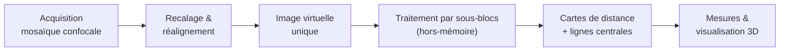

*Mesurer le cerveau en 3D : de la microscopie aux outils logiciels.*

Ma thèse de doctorat s'est déroulée à l'**INRIA Sophia Antipolis**, au sein de l'équipe Epidaure, sous la direction de Grégoire Malandain. Elle s'inscrivait dans le projet **MicroVisu3D**, qui réunissait trois mondes : les **anatomistes** de l'INSERM (unité U455), qui avaient besoin de quantifier la micro-circulation cérébrale ; les chercheurs en **analyse d'images** de l'INRIA ; et un **partenaire industriel**, TGS Europe, éditeur du logiciel de visualisation 3D *Amira*.

Il s'agissait d'une **thèse CIFRE**, financée par l'entreprise : j'étais donc, dès le doctorat, à l'interface directe entre la recherche académique et le monde industriel. Mon rôle a consisté à traduire un besoin scientifique — *« pouvoir mesurer en 3D le réseau vasculaire du cortex »* — en une chaîne d'outils logiciels concrète, utilisable par des non-informaticiens et intégrable dans un environnement industriel existant.

> Ce travail a donné lieu à des publications dans des revues et conférences internationales à comité de lecture. Mais au-delà de la production scientifique, c'est une expérience de **R&D appliquée menée de bout en bout** — du recueil du besoin jusqu'à la livraison d'outils éprouvés — que je décris ici.

Cette thèse illustre une idée qui guide encore mon travail aujourd'hui : **un algorithme n'a de valeur que s'il reste robuste face aux données réelles — imparfaites, volumineuses, et toutes différentes les unes des autres.**

---

## Le défi : mesurer un réseau immense à l'échelle du micron

Pour étudier le réseau micro-vasculaire cérébral, les anatomistes avaient besoin d'images capables de capturer **le plus petit des capillaires** (résolution de quelques microns) sur une **surface de cortex suffisamment large** pour être statistiquement significative (de l'ordre du centimètre). Aucun instrument ne pouvait acquérir une telle image en une seule fois.

La solution retenue : **paver la zone à imager de nombreuses petites images** acquises au microscope confocal, puis les assembler en une seule grande « mosaïque d'images ». Ce choix résolvait le problème d'acquisition, mais en créait deux nouveaux :

- la mosaïque obtenue était **trop volumineuse pour être chargée en mémoire** d'un ordinateur standard et traitée en une seule fois ;
- le microscope confocal impose une **grille anisotrope** (les voxels ne sont pas cubiques), ce qui complique toute mesure de distance dans l'image — et donc tout calcul de diamètre de vaisseau.



## Ma démarche : une chaîne de traitement de bout en bout

J'ai conçu une chaîne complète, du capteur jusqu'à la mesure, pensée dès le départ pour fonctionner sur des données qui ne tiennent pas en mémoire.

Deux maillons de cette chaîne ont fait l'objet de contributions méthodologiques originales : le calcul des **cartes de distance** et l'extraction des **lignes centrales**.

## Contribution 1 — Des cartes de distance qui s'adaptent toutes seules

Pour mesurer le rayon d'un vaisseau en chaque point, on calcule une *carte de distance* : à chaque voxel, on associe la distance au bord le plus proche. La distance euclidienne exacte est coûteuse ; les **distances de chanfrein** l'approximent très efficacement en propageant de petits poids entiers entre voxels voisins.



Le point délicat : sur une grille anisotrope — cas de la quasi-totalité des modalités d'imagerie médicale — ces poids doivent être recalculés, et les choisir à la main est fragile et spécifique à chaque modalité.

Ma contribution a été de proposer un **calcul automatique des coefficients de chanfrein optimaux**, celui qui minimise l'erreur par rapport à la vraie distance euclidienne — et ce **quelle que soit l'anisotropie de la grille ou la modalité d'image**, sans aucun réglage manuel. La même méthode s'applique donc indifféremment à un scanner, une IRM ou un microscope confocal.

> Le socle théorique de ces masques de chanfrein a été approfondi lors de mon post-doctorat : voir [Des fondations mathématiques aux images médicales](/fr/projects/postdoc-uppsala/).

## Contribution 2 — Extraire les lignes centrales, même hors-mémoire

À partir de la carte de distance, on extrait les **lignes centrales** des vaisseaux — les courbes qui passent par le centre de chaque vaisseau. Elles capturent la topologie du réseau et permettent d'en mesurer les longueurs, les embranchements et les rayons.

Les méthodes classiques de squelettisation exigent de charger l'image entière en mémoire — impossible ici. J'ai donc proposé une **squelettisation par blocs**, qui travaille sur des sous-images tout en préservant les trois propriétés essentielles d'un squelette : l'**homotopie** (même topologie que l'objet de départ), la **localisation** (le squelette reste centré) et la **minceur**. L'algorithme minimise par ailleurs le nombre d'accès aux sous-images, pour garantir un temps de calcul acceptable.



Une fois les lignes centrales et les rayons obtenus, les vaisseaux sont modélisés comme des **ensembles de cylindres** (structure de données *LineSet*), permettant à la fois une visualisation 3D temps réel et l'extraction de paramètres quantitatifs : distributions de diamètres, de longueurs, densités vasculaires par couche corticale…



## Une méthode générique, bien au-delà du cerveau

Aucune de ces méthodes ne fait d'hypothèse propre au cerveau. **Toute grande image binaire de structures tubulaires** peut être traitée de la même façon. Je l'ai validée sur des racines de plantes ; elle est directement transposable à des réseaux de neurones, à la porosité de matériaux, voire à la cartographie de pipelines.



Cette capacité à résoudre un problème dans un domaine, puis à le transposer ailleurs, est au cœur de ma manière d'aborder le prototypage.

## Compétences mobilisées

- Recueil d'un besoin scientifique et traduction en spécifications logicielles
- Collaboration avec un partenaire industriel (thèse CIFRE, intégration dans le logiciel *Amira* / TGS Europe)
- Conception d'algorithmes **robustes et automatiques**, sans paramétrage manuel
- Traitement de **données volumineuses hors-mémoire** (par sous-blocs)
- Géométrie discrète, distances de chanfrein, topologie discrète
- Conception de protocoles de **validation** (données synthétiques + données réelles)

## Publications issues de la thèse



## Ce que cette thèse m'a apporté

Cette thèse a été pour moi **une première école du prototypage appliqué**, bien davantage qu'un exercice théorique.

Comme il s'agissait d'une thèse CIFRE, j'ai d'abord appris à **travailler entre plusieurs mondes** : poser les bonnes questions à des anatomistes, traduire leur besoin en problème algorithmique, et livrer un résultat intégrable dans le logiciel d'un partenaire industriel. Cette posture de traductrice entre l'usage et la technique est restée au centre de ma pratique.

J'y ai ensuite forgé le réflexe de **concevoir des méthodes robustes et automatiques**. Face à des données toutes différentes — grilles anisotropes variables, contrastes inégaux — j'ai cherché des algorithmes qui *s'adaptent d'eux-mêmes* plutôt que de multiplier les réglages manuels, sources de fragilité et de variabilité.

J'ai aussi pris goût à la **généricité** : développer des outils qui dépassent leur cas d'usage initial. Les mêmes briques, conçues pour le cerveau, se sont révélées utiles pour des racines de plantes — et bien d'autres domaines.

Enfin, j'ai appris à composer avec une contrainte très concrète : **des données trop grandes pour la mémoire**. Penser le calcul par morceaux, sans jamais sacrifier la justesse du résultat, est un savoir-faire qui sert dans tout projet manipulant de gros volumes.

Ces savoir-faire — construits *en parallèle* d'un travail soutenu de publication scientifique — sont ceux que je mets aujourd'hui au service du prototypage d'applications médicales.
